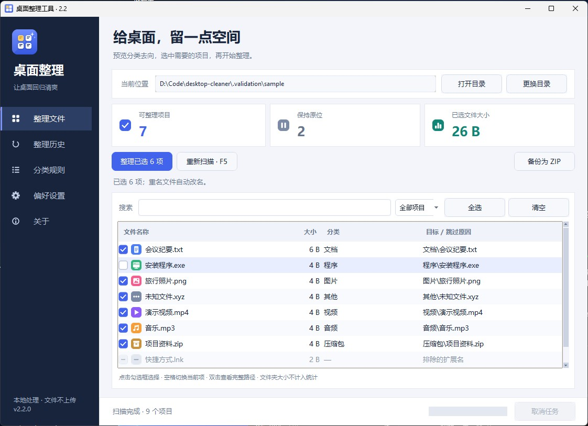
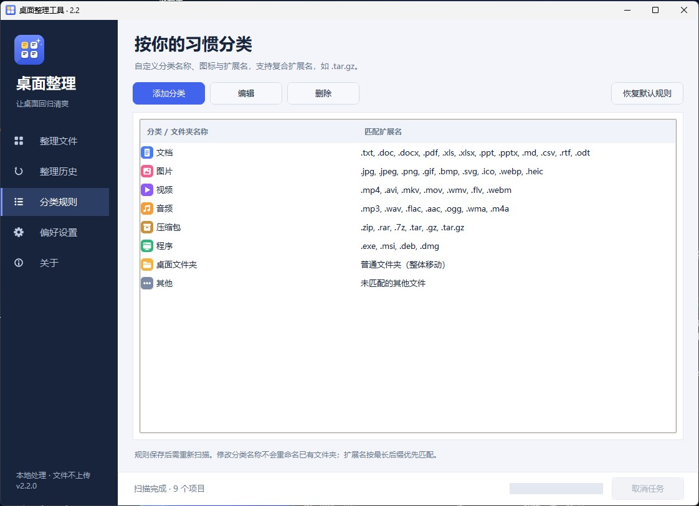

# 桌面整理工具 2.2

一个使用 Python + Tkinter 编写的 Windows 桌面整理工具。先预览文件的分类去向，再选择要整理的项目；每次移动自动记录，支持恢复与 ZIP 备份。所有处理均在本地完成。



### 界面预览

主界面会先列出文件的分类去向，支持搜索、筛选和逐项勾选：


偏好设置把整理和备份分开管理，备份不受整理过滤条件影响：


分类规则页支持扩展名、复合扩展名和文件夹规则：



添加或编辑分类时可以选择彩色图标，并即时检查名称和扩展名：


## 2.2 更新

- **彩色分类图标**：Tk 无法显示彩色 emoji，现在文件列表、分类规则页和分类编辑对话框都使用 `tools/make_assets.py` 绘制的 14 种彩色图标（文档、图片、视频、音频、压缩包、程序、文件夹、其他、代码、表格、设计、下载、书籍、收藏）；分类名开头的 emoji 仅用于文件夹名，界面中不再重复显示。
- **图标选择器**：编辑或新建分类时可直接点选图标，保存在配置的 `icon` 字段，旧配置自动按 emoji 匹配。
- **界面重绘**：文件列表首列改为「勾选框 + 分类图标 + 文件名」，勾选框为绘制的圆角样式；侧边导航使用线性图标与高亮条；统计卡片带图标；按钮、输入框、下拉框改为九宫格圆角样式，含悬停 / 按下 / 禁用 / 聚焦状态；设置页复选框与列表勾选框风格一致。
- **多倍率资源**：`assets/1x`、`1.5x`、`2x` 三套位图按系统缩放自动选用；资源缺失时自动退回文字样式，不影响功能。

## 2.1 更新

- **全新图标**：重绘为多尺寸 ICO（16–256 px），任务栏、标题栏、资源管理器大图标均清晰；侧边栏与关于页使用同一标志。图标由 `tools/make_icon.py` 生成，可自行修改后重新输出。
- **界面修正**：次级按钮在白色卡片上有了可见边框与悬停反馈；最小窗口（900×640）下文件列表仍保留多行可见，设置页不再裁切；`🖼️` 等带变体选择符的分类名不再显示多余空格；勾选标记改用清晰的 ☐ / 🗹。
- **高 DPI 与小屏幕**：按系统缩放比例调整窗口、列宽与行高；默认窗口尺寸会适配 1366×768 等小屏，并在首次启动时居中。
- **更省心**：滚动条按需显示；`Ctrl+A` 全选当前列表；分类规则页新增“恢复默认规则”；整理历史页新增“查看详情”按钮；大小上限输入非法时给出提示而不是报错。
- **更稳妥**：无控制台的 EXE 若启动失败或界面出错，会弹窗显示详细原因，而不是静默退出。

## 使用方式

1. 打开程序，自动扫描当前用户的桌面；也可以点击 **更换目录**。
2. 查看文件名称、大小、分类、目标位置和跳过原因。搜索支持文件名、分类和原因；可筛选可整理、已跳过或已勾选项目。
3. 点击每行开头的勾选框选择文件，点击 **整理已选项目** 并确认。**全选 / 清空只作用于当前筛选结果**，其他筛选下的选择会保留；主按钮显示全部已选数量。
4. 到 **整理历史** 选择记录，点击 **恢复选中记录**。恢复遇到同名文件会自动改名保留两份。
5. 如需备份，点击 **备份为 ZIP** 选择一个新的文件名。ZIP 可以使用常见解压工具打开，不依赖本软件。

快捷键：`F5` 重新扫描，`Ctrl+F` 搜索，文件列表中 `空格` 切换当前项勾选、`Ctrl+A` 全选当前筛选结果，任务运行时 `Esc` 取消。双击文件行可以查看、复制完整路径。

## 主要功能

- **预览与选择**：整理前展示准确目标名（包括重名后的新名称），显示可整理数量、跳过数量与已选文件大小。文件夹大小不递归计算，也不计入统计。
- **分类规则**：支持添加、编辑、删除分类、选择图标和一键恢复默认，扩展名大小写归一化，支持中文逗号及 `.tar.gz` 等复合扩展名；最长后缀优先。重复扩展名和不合法的 Windows 文件夹名称会被阻止。
- **整理保护**：默认保留快捷方式和普通文件夹；跳过系统、隐藏项目、目录联接及重解析点。可以设置大小上限，`0` 表示不限；开启文件夹整理时整体移动，不拆分内容。
- **后台执行**：扫描、整理、恢复、备份均在后台线程执行。任务期间阻止重复操作，可以取消；窗口关闭时会提示先安全结束任务。
- **自动历史记录**：移动前落盘记录操作意图，逐项保存结果。中途退出、取消、部分失败后，已完成项目仍有记录可恢复。支持导出记录和导入旧版 JSON 记录。
- **独立备份规则**：备份不沿用整理的扩展名与大小过滤，包含快捷方式和大文件；子文件夹是否包含由独立选项控制。保留空文件夹，列出无法读取或跳过的项目。
- **配置持久化**：兼容原来的列表分类和导出配置包装格式，支持 JSON 文件导入导出。配置验证通过后才保存，写入采用临时文件替换。
- **原生界面**：侧边导航、统计卡片、彩色分类图标、圆角控件、可滚动文件列表、独立分类与设置页面；支持高 DPI 缩放，保留 Windows 标题栏、拖动、最大化与窗口缩放。

## 文件与恢复行为

- 分类文件夹直接创建在当前整理目录内，保留既有分类名称，不额外创建父文件夹。
- 同名文件不会被覆盖。预览后如果源文件内容/身份变化或目标被占用，该项会报错并保留，重新扫描后再处理。
- 记录不是文件内容备份。手动删除、替换或移走已整理的文件后，记录可能无法恢复该项；请保留重要文件的独立备份。
- 新版记录检查目录、链接、文件身份。旧版记录仅支持恢复当前所选目录内的分类文件；外部记录保留原样，并在数据目录保存可重复恢复的工作副本。
- 恢复只删除本次整理创建且已为空的目录，不删除用户的 `desktop.ini` 或其他内容。
- ZIP 备份先写临时文件，取消或读写失败后不发布不完整的文件。遍历时无法读取的目录会在结果中列出，因此应检查结果中的问题和跳过列表。
- 整理取消在当前项目结束后生效；备份按 1 MB 分块检查取消。系统文件操作本身阻塞时，取消需要等待该操作返回。
- 不处理 Windows 图标的屏幕坐标排列；恢复指文件路径恢复。

## 运行与构建

运行时只使用 Python 标准库，需要带 Tk 的 Python 3.8 或更高版本。

```powershell
python desktop_cleaner.py
```

可以使用独立目录试用：

```powershell
python desktop_cleaner.py --directory "D:\TestDesktop" --data-dir "D:\CleanerTestData"
```

构建：

```powershell
python -m pip install -r requirements.txt
python build.py
```

产物为 `dist/桌面整理工具.exe`（单文件，约 9 MB），已嵌入多尺寸应用图标、界面位图资源、2.2.0 版本信息及完整 MIT 许可；同时生成 `dist/桌面整理工具-2.2.0-Windows-x64.zip` 与 `dist/SHA256.txt`（加 `--no-zip` 可跳过压缩包）。构建脚本使用当前 Python 解释器调用 PyInstaller，可从其他工作目录运行。

本次 Windows x64 产物采用 Python 3.8.10 + PyInstaller 5.13.2，以保留项目原有旧 Windows 兼容方向；实际验证环境为 Windows 11，未在 Windows 7/8 真机上验证。使用较新的 Python 构建时，系统要求取决于对应运行时。

重新生成应用图标与界面位图（仅构建期需要 Pillow；运行时和 EXE 都不依赖 Pillow）：

```powershell
python -m pip install pillow
python tools/make_icon.py
python tools/make_assets.py
```

## 数据目录与旧版升级

默认配置：`%LOCALAPPDATA%\DesktopCleaner\config.json`。

整理记录：`%LOCALAPPDATA%\DesktopCleaner\records\`。

首次启动时，在没有用户配置的情况下读取源码目录（或 EXE 同目录）的旧 `config.json`。原配置不会被自动覆盖。旧配置中的文件夹备份选项会保留；全新默认配置包含子文件夹备份。偏好设置页可打开数据目录，也可使用 `--data-dir` 指定独立目录。

原来的 `backup_record.json` 或带时间戳的记录可通过 **整理历史 → 导入旧记录** 恢复，请先切换到记录对应的目录。

## 开发与验证

```powershell
python -m unittest discover -s tests -v
```

测试会创建独立临时目录，不整理真实桌面。GUI 测试需要可用的 Windows 桌面 / Tk 环境。

- `cleaner_core.py`：配置校验、扫描计划、逐项记录、恢复、ZIP 备份。
- `desktop_cleaner.py`：Tkinter 界面、后台任务队列、文件与配置入口。
- `tools/make_icon.py`：从零绘制 `app_icon.ico` 及 `docs/icon*.png`。
- `tools/make_assets.py`：绘制 `assets/` 下的分类图标、勾选框、导航图标、圆角控件九宫格与侧边栏标志（三种倍率）。
- `tests/test_core.py`：冲突、中断、取消、记录失败、备份完整性、旧数据兼容和 Windows 目录联接。
- `tests/test_gui.py`：真实 Tk 窗口中的任务流、筛选、设置持久化、最小窗口布局与控件可见性。
- `docs/VALIDATION.md`：本次验证结果与边界。

## 许可

MIT License，见 [LICENSE](LICENSE)。原作者：Bin。允许商业使用、修改和分发，须保留版权及许可声明。
